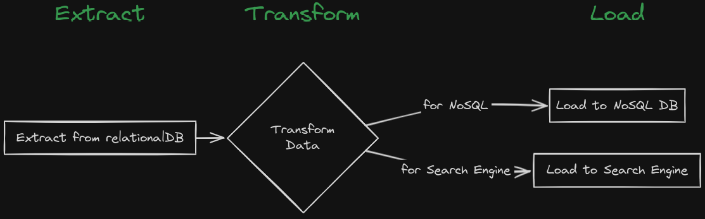
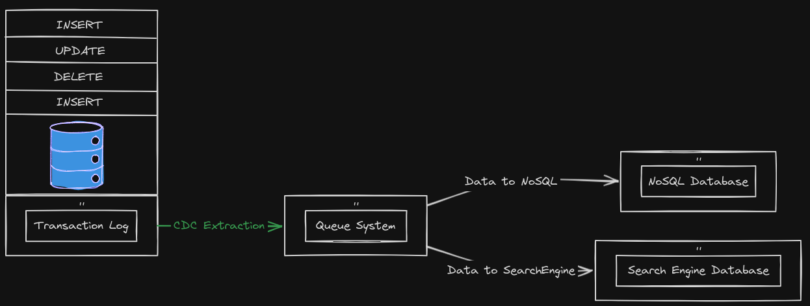

# Capture Data Change from Postgres and Publish to Kafka

This project demonstrates how to [capture data change (CDC)](https://debezium.io/documentation/faq/#what_is_change_data_capture) from Postgres and publish to Kafka. The project uses [Debezium](https://debezium.io/documentation/faq/#what_is_debezium) as the CDC tool to capture data change from Postgres and publish to Kafka.

## The challange

In large enterprises, data is stored in multiple databases. I have seen too many times codes that send the same data to multiple databases. Like this:

```python
relational_db.save(data)
nosql_db.save(data)
search_engine.save(data)
```

There are big challenges with this approach:

1. **Consistency**: How to keep consistency between these databases? How to deal with the failure of one of these databases? And if the ordering of the data is important?
2. **Scalability**: How to deal with scalability when the performance depends on the slowest database?
3. **Complexity**: The code is complex and hard to maintain. Imagine many points in the code and others microservices doing the same thing.

The traditional way to keep consistency between these databases is to use the ETL (Extract, Transform, Load) process. The ETL process is a batch-oriented process that extracts data from the source database, transforms the data, and loads the data into the target database. The ETL process has some limitations, like the ETL process is batch-oriented, which means it can't provide real-time data synchronization. The ETL process is also complex and expensive.



### Change Data Capture (CDC)

Change Data Capture, or CDC, is an older term for a system that monitors and captures the changes in data so that other software can respond to those changes. Data warehouses often had built-in CDC support, since data warehouses need to stay up-to-date as the data changed in the upstream OLTP databases.



## Using Debezium to capture data change

[Debezium](https://debezium.io/documentation/faq/#what_is_debezium) is a set of distributed services that capture row-level changes in your databases so that your applications can see and respond to those changes. Debezium records in a transaction log all row-level changes committed to each database table. Each application simply reads the transaction logs they’re interested in, and they see all of the events in the same order in which they occurred.

You can check what databases Debezium supports [here](https://debezium.io/documentation/faq/#what_databases_can_debezium_monitor).

You can output the data change to different sinks like Kafka, Amazon Kinesis, Google Cloud Pub/Sub, etc.

In this cookbook, I will use Debezium Postgres connector via Kafka Connect.

Let's set up the Debezium components - Zookeeper, Kafka, PostgreSQL, and Connect - using individual `docker run` commands.

### Zookeeper

Zookeeper is a centralized service for maintaining configuration information, naming, providing distributed synchronization, and providing group services. Let's start by running Zookeeper:

```bash
docker run --rm \
  --name zookeeper \
  -p 2181:2181 \
  debezium/zookeeper:2.1
```

### Kafka

Kafka is a distributed streaming platform that is commonly used for building real-time streaming data pipelines and applications.

```bash
docker run --rm \
  --name kafka \
  -p 9092:9092 \
  --env ZOOKEEPER_CONNECT=zookeeper:2181 \
  --link zookeeper \
  debezium/kafka:2.1
```

### PostgreSQL

Let's launch a PostgreSQL instance:

```bash
docker run --rm \
  --name postgres \
  -p 5432:5432 \
  --env POSTGRES_PASSWORD=postgres \
  --env POSTGRES_HOST_AUTH_METHOD=trust \
  --env POSTGRES_USER=postgres \
  postgres:15.2-alpine3.17
```

Let's change the `wal_level` to `logical` in the `postgresql.conf` file. PostgreSQL’s [logical](https://www.postgresql.org/docs/current/static/logicaldecoding-explanation.html) decoding feature was introduced in version 9.4. It is a mechanism that allows the extraction of the changes that were committed to the transaction log and the processing of these changes in a user-friendly manner with the help of an [output plug-in](https://www.postgresql.org/docs/current/logicaldecoding-output-plugin.html). The output plug-in enables clients to consume the changes.

1. Open a bash shell in the PostgreSQL container:

```bash
  docker exec -it postgres bash
```

2. Find the `postgresql.conf` file:

```bash
  find / -name postgresql.conf
```

3. Edit the `postgresql.conf` file, uncomment the `wal_level` line, and set it to `logical`

```conf
  wal_level = logical
```

4. Exit and restart the PostgreSQL container:

```bash
  docker restart postgres
```

#### Create a database and table

Let's create a database and table in PostgreSQL:

1. Open a psql shell in the PostgreSQL container:

```bash
docker exec -it postgres psql -U postgres
```

2. Create a database and table, and insert some data:

```sql
CREATE DATABASE inventory;
\c inventory;
CREATE EXTENSION IF NOT EXISTS "uuid-ossp";

CREATE TABLE products (
  id UUID PRIMARY KEY DEFAULT uuid_generate_v4(),
  name TEXT NOT NULL,
  weight FLOAT NOT NULL,
  created_at TIMESTAMPTZ NOT NULL DEFAULT now()
);

INSERT INTO
  products (name, weight)
VALUES
  ('scooter', 3.14),
  ('car battery', 8.1),
  ('12-pack drill bits', 0.8),
  ('hammer', 0.75);
```

### Debezium Connect

Debezium Connect is a distributed service that captures row-level changes in your databases so that your applications can see and respond to those changes. Debezium Connect uses Kafka Connect to capture row-level changes in your databases. Kafka Connect is a framework for connecting Kafka with external systems such as databases, key-value stores, search indexes, and file systems.

1. Let's start Debezium Connect:

```bash
docker run --rm \
  --name connect \
  -p 8083:8083 \
  --env CONFIG_STORAGE_TOPIC=connect_configs \
  --env OFFSET_STORAGE_TOPIC=connect_offsets \
  --env STATUS_STORAGE_TOPIC=connect_statuses \
  --env BOOTSTRAP_SERVERS=kafka:9092 \
  --link kafka \
  --link postgres \
  debezium/connect:2.1
```

2. Register the Debezium Postgres connector:

```bash
curl -i -X POST -H "Accept:application/json" -H "Content-Type:application/json" localhost:8083/connectors/ -d '{
  "name": "inventory-connector",
  "config": {
    "connector.class": "io.debezium.connector.postgresql.PostgresConnector",
    "database.hostname": "postgres",
    "database.port": "5432",
    "database.user": "postgres",
    "database.password": "postgres",
    "database.dbname": "inventory",
    "topic.prefix": "inventory",
    "plugin.name": "pgoutput"
  }
}'
```

Let's check the status of the connector:

```bash
curl -H "Accept:application/json" localhost:8083/connectors/inventory-connector/status
```

Let's check the topics created by the connector:

```bash
docker exec connect /kafka/bin/kafka-topics.sh --bootstrap-server kafka:9092 --list
```

Let's consume the `inventory.public.products` topic:

```bash
docker exec connect /kafka/bin/kafka-console-consumer.sh --bootstrap-server kafka:9092 --topic inventory.public.products --from-beginning
```

You can see some data in the `inventory.public.products` topic. The data is the snapshot of the `products` table in the `inventory` database.
For default, the Debezium Postgres connector uses the `snapshot.mode` property set to `initial`. The `initial` mode means that the connector will perform an [initial](https://debezium.io/documentation/reference/stable/connectors/postgresql.html#postgresql-property-snapshot-mode) consistent snapshot of the database.

Let's analyze the data in the `inventory.public.products` topic:

```json
{
  "schema": {
    ...
  },
  "payload": {
    ...
  }
}
```

The `schema` field specifies a Kafka Connect schema that describes the structure of the data. The `payload` field contains the actual data.

Let's dig into the `payload` field:

```json
{
  "schema": {...},
  "payload": {
    "before": null,
    "after": {
      "id": "8eb22f16-1763-4023-8b61-6b6bc21b8e8f",
      "name": "hammer",
      "weight": 0.75,
      "created_at": "2024-04-13T17:04:10.581758Z"
    },
    "source": {
      "version": "2.1.4.Final",
      "connector": "postgresql",
      "name": "inventory",
      "ts_ms": 1713056376651,
      "snapshot": "last",
      "db": "inventory",
      "sequence": "[null,\"26842648\"]",
      "schema": "public",
      "table": "products",
      "txId": 741,
      "lsn": 26842648,
      "xmin": null
    },
    "op": "r",
    "ts_ms": 1713056376796,
    "transaction": null
  }
}
```

Now, the important field is the `op` field. The `op` field specifies the operation that was performed on the row. The 'r' value means that the row was read by the snapshot process.

Let's change the data in the `products` table to see the data change in the `inventory.public.products` topic:

```sql
--docker exec -it postgres psql -U postgres
\c inventory;
UPDATE products SET weight = 0.5 WHERE name = 'hammer';
```

The `inventory.public.products` topic should now contain the data change.

```json
{
  "schema": {...},
  "payload": {
    "before": null,
    "after": {
      "id": "8eb22f16-1763-4023-8b61-6b6bc21b8e8f",
      "name": "hammer",
      "weight": 0.5,
      "created_at": "2024-04-13T17:04:10.581758Z"
    },
    "source": {...},
    "op": "u",
    "ts_ms": 1713059333521,
    "transaction": null
  }
}
```

The `op` field now has the 'u' value, which means that the row was updated. The `after` field contains the updated data. The `before` field contains 'null'. Sometimes you want to see the previous data for some table. You must change the [REPLICA IDENTITY](https://www.postgresql.org/docs/current/static/sql-altertable.html#SQL-CREATETABLE-REPLICA-IDENTITY) of the table, according to the [Debezium documentation](https://debezium.io/documentation/reference/stable/connectors/postgresql.html#postgresql-replica-identity). Like:

```sql
ALTER TABLE products REPLICA IDENTITY FULL;
```

Now the `before` field will contain the previous data on update and delete operations.

## Conclusion

In this cookbook, we learned how to capture data change from Postgres and publish to Kafka using Debezium. Debezium is a powerful tool that can help you keep consistency between your databases. Debezium can capture data change from different databases like MySQL, Postgres, MongoDB, etc. Debezium can output the data change to different sinks like Kafka, Amazon Kinesis, Google Cloud Pub/Sub, etc. Debezium is a great tool to keep your databases in sync.

For production environments, you will deal with more complex scenarios like high availability, monitoring, scaling, table schema changes, etc. Ping me if you want a cookbook for these scenarios 😉

Thanks for reading!
