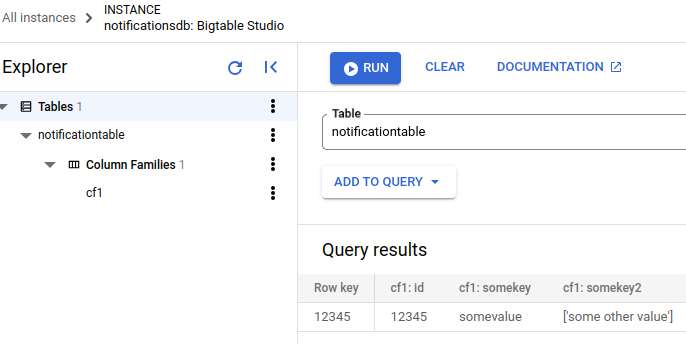

# Pubsub to BigTable

This is a simple example of how to use Apache Beam to read messages from a Pubsub subscription and write them to a BigTable table.

## Setup

1. Create a BigTable instance and a table in the Google Cloud Console.
2. Create a Pubsub topic and a subscription in the Google Cloud Console.
3. Create a service account with the following roles:
    - Bigtable Admin
    - Bigtable User
    - Pub/Sub Subscriber
4. Download the service account key as a JSON file.
5. Set the following environment variables:
    - `GOOGLE_APPLICATION_CREDENTIALS` to the path of the service account key JSON file.
6. Install the required Python packages:
```bash
pip install -r requirements.txt
```
7. Publish a message to the Pubsub topic.
```bash
gcloud pubsub topics publish <TOPIC_ID> --message "{"id":"12345","somekey":"somevalue","somekey2":["some other value"]}"
```

## Running the pipeline

Run the pipeline with the following command:

```bash
python script.py \
    --subscription_id <SUBSCRIPTION_ID> \
    --project_id <PROJECT_ID> \
    --instance_id <INSTANCE_ID> \
    --table_id <TABLE_ID>
```

Replace the placeholders with the appropriate values.

### Checking the results

You can check the results by running the following command:

```bash
cbt -project <PROJECT_ID> -instance <INSTANCE_ID> lookup <TABLE_ID> 12345
```

